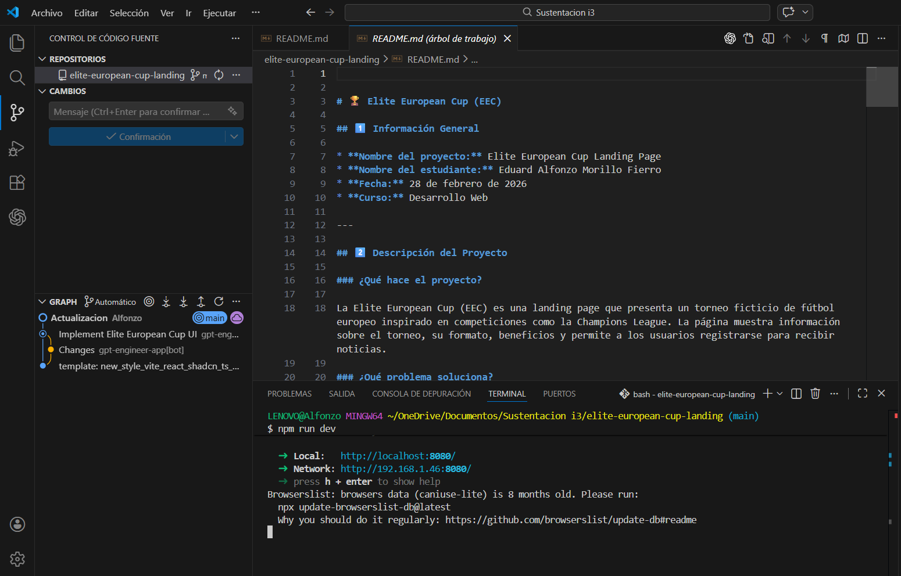
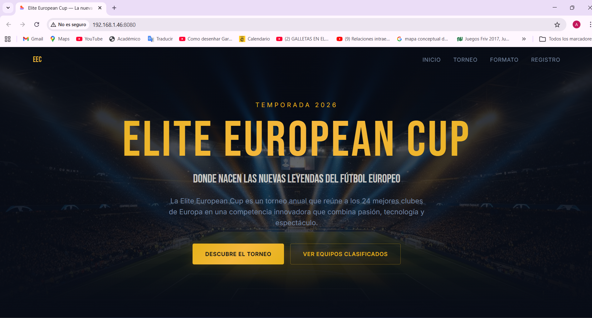

Elite European Cup (EEC)
1️⃣ Información General

Nombre del proyecto: Elite European Cup Landing Page

Nombre del estudiante: Eduard Alfonzo Morillo Fierro

Fecha: 28 de febrero de 2026

Curso: Desarrollo Web

2️⃣ Descripción del Proyecto
¿Qué hace el proyecto?

La Elite European Cup (EEC) es una landing page que presenta un torneo ficticio de fútbol europeo inspirado en competiciones como la Champions League. La página muestra información sobre el torneo, su formato, beneficios y permite a los usuarios registrarse para recibir noticias.

¿Qué problema soluciona?

El proyecto simula la necesidad de promocionar un evento deportivo moderno mediante una página web profesional, atractiva y responsiva. Permite centralizar información del torneo y mejorar la experiencia digital de los fanáticos.

¿Para quién está pensado?

Está dirigido a:

Aficionados al fútbol europeo

Clubes deportivos

Organizadores de eventos

Usuarios interesados en torneos internacionales

3️⃣ Tecnologías Utilizadas

HTML

CSS

JavaScript

Tailwind CSS

Vite

Node.js

Git

GitHub

4️⃣ Estructura del Proyecto
elite-european-cup-landing/
│
├── public/              # Archivos públicos (imágenes, recursos estáticos)
├── src/                 # Código principal del proyecto
├── index.html           # Archivo principal de la aplicación
├── package.json         # Configuración del proyecto y dependencias
├── tailwind.config.ts   # Configuración de Tailwind
├── vite.config.ts       # Configuración de Vite
└── README.md            # Documentación del proyecto
Explicación:

public/: Contiene recursos estáticos como imágenes.

src/: Contiene los componentes y archivos principales del código.

index.html: Punto de entrada de la aplicación.

package.json: Archivo que gestiona dependencias y scripts.

tailwind.config.ts: Configuración del framework Tailwind.

vite.config.ts: Configuración del entorno de desarrollo Vite.

5️⃣ Funcionalidades

Página principal con sección hero llamativa.

Sección informativa sobre el torneo.

Explicación del formato de competencia.

Diseño moderno y responsivo adaptable a móvil y escritorio.

Botones interactivos con efectos hover.

Sección de llamado a la acción para registro.

6️⃣ Capturas de Pantalla

7️⃣ Cómo Ejecutar el Proyecto
Paso a paso:

Clonar el repositorio:

git clone URL_DEL_REPOSITORIO

Entrar a la carpeta del proyecto:

cd elite-european-cup-landing

Instalar dependencias:

npm install

Ejecutar el servidor de desarrollo:

npm run dev

Abrir en el navegador la URL que aparece en la terminal (ejemplo: http://localhost:5173
)

8️⃣ Mejoras Futuras

Implementar sistema real de registro de usuarios.

Conectar con una base de datos.

Agregar autenticación.

Incluir tabla dinámica de posiciones.

Añadir animaciones avanzadas.

Desplegar versión oficial en dominio propio.